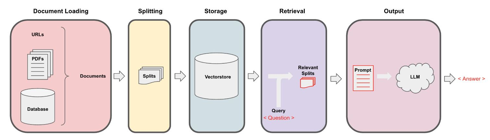
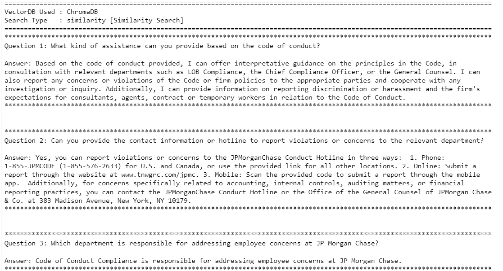
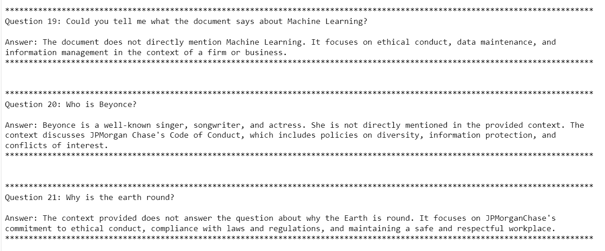

# Project: HR Policy Query Resolution System using RAG pipeline

### Objective:
Design and implement an advanced Retrieval-Augmented Generation (RAG) system for efficient and context-aware resolution of HR policy queries, leveraging document retrieval and generation techniques to extract and synthesize relevant information from policy documents.

 

### Problem Statement:
This project addresses the need for an automated solution capable of answering HR policy-related queries with high precision. The system is designed to:
- Process and organize policy documents.
- Retrieve contextually relevant content based on user input.
- Generate accurate, informative responses that reflect the content of the documents.

### Example:
Given a query regarding HR policies, the system should retrieve the most relevant document segments and generate a contextually-relevant response based on those.

---

### Pre-requisites:
- *HR Policy Document PDFs* – The primary source of policy-related data.
- *Pre-trained Embedding Model ("all-mpnet-base-v2")* – Used for converting document chunks into embeddings.
- *Vector Storage (e.g., ChromaDB or FAISS)* – For storing document chunks and their embeddings.
- *Mistral-7B-Instruct-v0.2 Large Language Model (LLM)* – For generating contextually relevant responses.

---

### Expected Outcome:
1. A robust system capable of processing and indexing HR policy documents.
2. A model that can retrieve the most relevant document segments based on a query.
3. Accurate and contextually relevant responses generated by the system.

### Output Format:
- *HR Policy Query Input*
- *Generated Response*

### Approach:
The system follows a series of steps to process documents and generate responses to queries:
1. **Document Loading**: Policy documents are loaded from the repository.
2. **Document Splitting**: Documents are divided into chunks for easier retrieval.
3. **Embedding Generation**: Each chunk is converted into embeddings using the "all-mpnet-base-v2" model.
4. **Vector Storage**: Chunks and embeddings are stored in ChromaDB for efficient retrieval.
5. **Query Resolution**: The system retrieves relevant document chunks based on the query and combines them with the input to generate a final response using the Mistral-7B-Instruct-v0.2 LLM.
6. **Response Output**: A contextually accurate response is generated and returned to the user. 

---

### Repository Files:
1. **Code File**: [rag_llm_pipeline_query_jpmc_code_of_conduct_policy.ipynb](./rag_llm_pipeline_query_jpmc_code_of_conduct_policy.ipynb)  
   Jupyter notebook with the implementation of the RAG pipeline and query resolution logic.
   
2. **HR Policy PDF**: [jp-morgan-chase-code-of-conduct-policy.pdf](./data_files/jp-morgan-chase-code-of-conduct-policy.pdf)  
   Example of a JP Morgan HR policy document for querying.

3. **Model Saving & Quantization**: [Script_For_Saving_LLM_Quantized_4bit_Model+Tokenizer.ipynb](./Script_For_Saving_LLM_Quantized_4bit_Model+Tokenizer.ipynb)  
   Code to download the Mistral-7B-Instruct-v0.2 LLM and its tokenizer, and save the quantized 4-bit version for efficient reloading.
   
---

### Outcome:
### RAG pipeline based responses:  

**(Case 1: In-context query responses)**

**(Case 2: Out-of-context query responses)**

---

Feel free to contribute by improving the workflow or suggesting optimizations!

### Disclaimer:
*The dataset utilized in this project has been obtained from public sources and is used solely for educational and research purposes. All efforts have been made to ensure that no proprietary or sensitive information is included. If you have any concerns or identify any conflicts regarding the use of this dataset, please feel free to get in touch. For inquiries or further information, you can <a href="mailto:cchaudha@usc.edu">contact me</a>.*

  
Thank you for taking the time to visit this repository!

